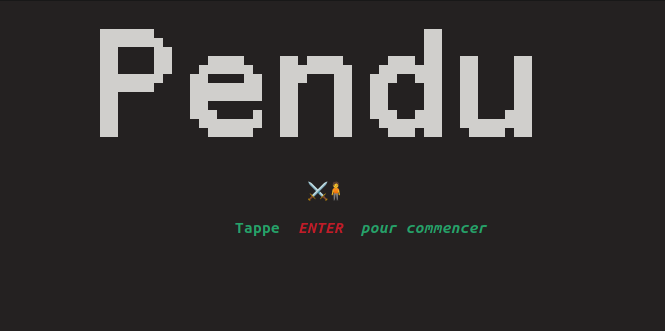

<p align="center">

</p>
<h1 align="center">Bash pendu</h1>
<p align="center">
  
  
  
</p>

<b align="center">Le bon vieux jeux du pendu écrit en Bash avec une simpliste interface graphique en console</b>
<p align="center">

</p>
<p align="center">

</p>

### Installation ###

**`Packages`**

```
toilet
```

´´´
$linux-⛓ pendu: sudo git clone https://github.com/Lucstay11/Bash-pendu
$linux-⛓pendu: cd Bash-pendu
$linux-⛓pendu: sudo chmod +x jeux.sh
``` 

**`Run the script`**

```
$linux-⛓pendu: bash jeux.sh
```
