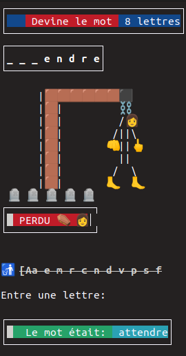

<p align="center">

</p>
<h1 align="center">Bash pendu</h1>
<p align="center">
  
  
  
</p>

<b align="center">Le bon vieux jeux du pendu écrit en Bash avec une simpliste interface graphique en console</b>
<p align="center">

</p>


**`Packages`**

```
toilet
```
**`Installation`**
```
$linux-⛓pendu: git clone https://github.com/Lucstay11/Bash-pendu
$linux-⛓pendu: cd Bash-pendu
$linux-⛓pendu: chmod +x jeux.sh
``` 

**`Lance le script`**

```
$linux-⛓pendu: bash jeux.sh
```


> Vous pouvez changer le dictionnaire de mot en remplacants le fichier m.txt

### Contacter moi sur:
<p align="left">
  <a href="https://github.com/Lucstay11" target="_blank"></a>
<a href="https://discord.gg/rCzQyKWj" target="_blank"></a>
</p>
